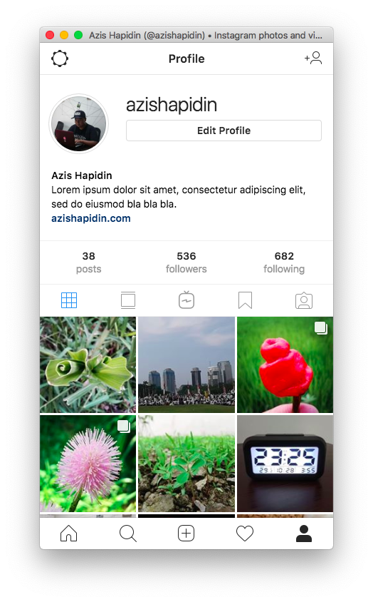

<p align="center">
  
</p>

<div align="center">
  <h1>Instagram Electron</h1>
  This is an electron app that brings the Instagram mobile experience onto desktop.
  <br/>
  This is a fork and successor of <a target="_blank" rel="noopener" href="https://github.com/azishapidin/instagram-electron">https://github.com/azishapidin/instagram-electron</a>.
</div>

## Install
See the [releases](https://github.com/Alex313031/instagram-electron/releases).

## Build
You will need Nodejs > 16.

```bash
# Clone this repository
git clone https://github.com/Alex313031/instagram-electron

# Go into the repository
cd instagram-electron

# Install dependencies
npm install

# Run the app
npm start
```

## Screenshot

<div style="text-align: center;">

</div>
